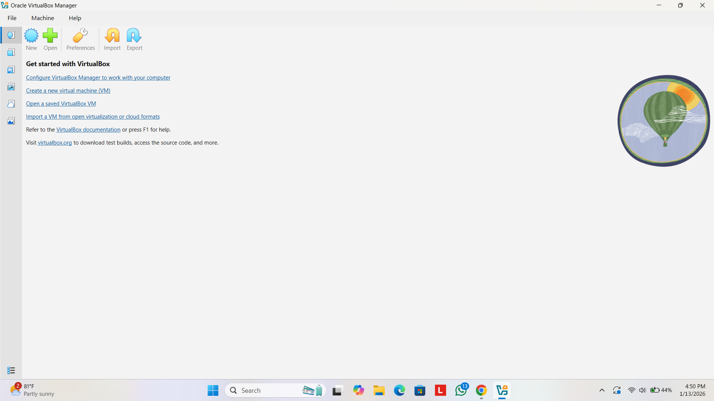
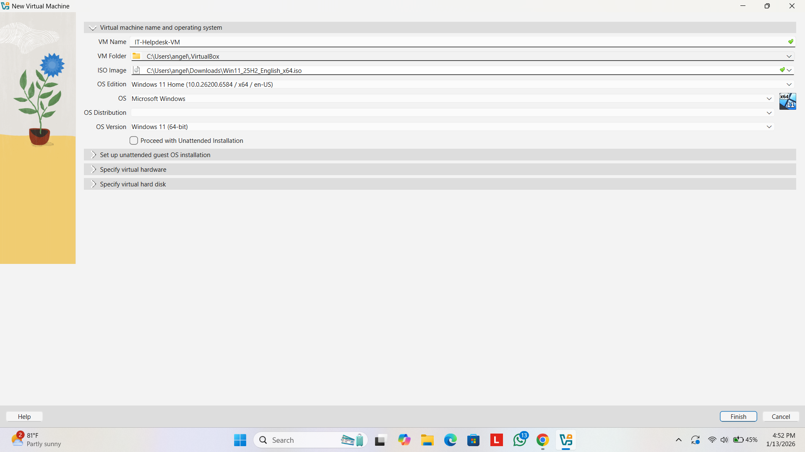
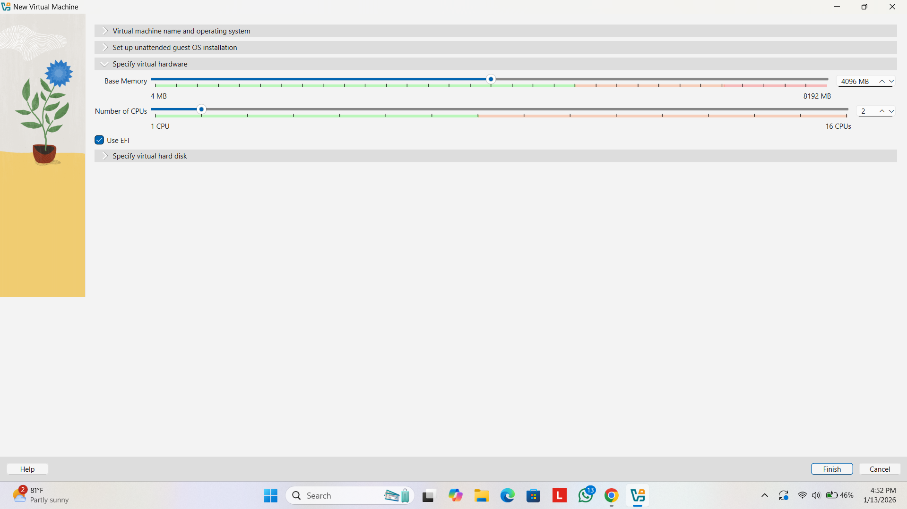
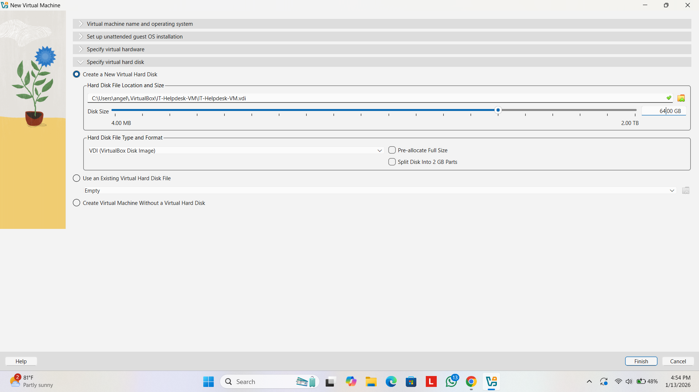
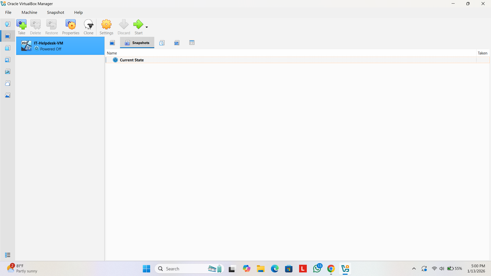
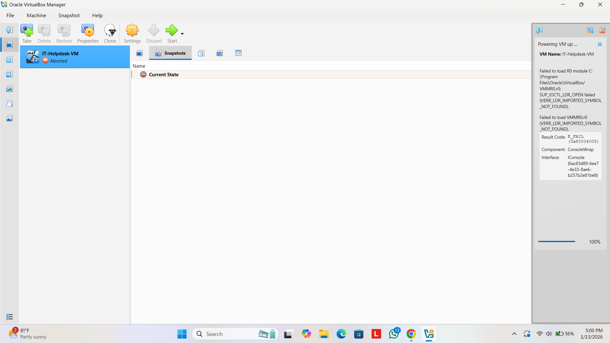
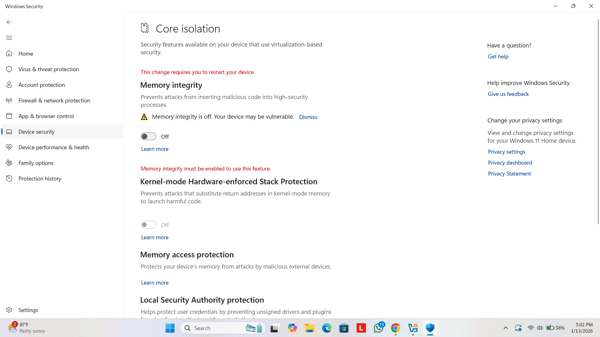
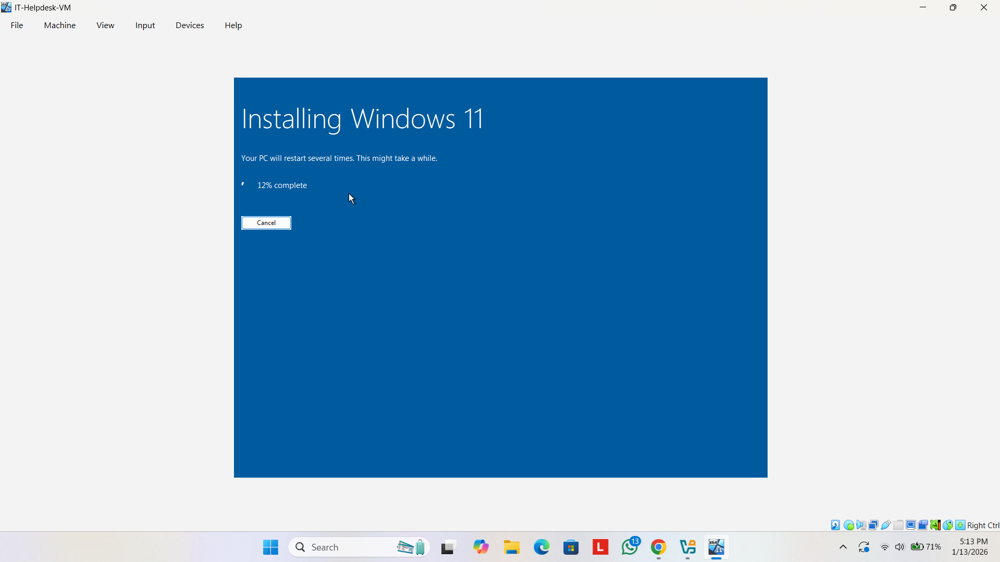
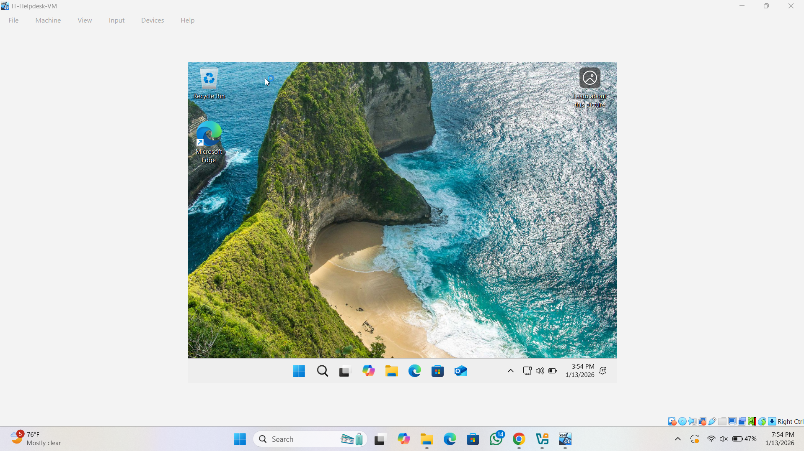

# IT Help Desk Troubleshooting Lab

## Overview
This project documents the setup of a Windows 11 virtual machine using Oracle VirtualBox and the troubleshooting of a real kernel-level startup error.
## Environment
- Host OS: Windows 11 Home
- Hypervisor: Oracle VirtualBox
- Guest OS: Windows 11
## Virtual Machine Setup

I created a Windows 11 virtual machine in Oracle VirtualBox and configured the system hardware and storage.

### VM Creation Evidence

## VM Startup Error

### Issue
After creating the virtual machine, the VM failed to start and entered an aborted state.

### What I Observed
- The virtual machine was created successfully
- The VM showed a powered-off state
- Attempting to start the VM caused it to abort immediately

### Error Message
Failed to load R0 module VMMR0.r0  
VERR_LDR_IMPORTED_SYMBOL_NOT_FOUND

### Error Evidence

## Resolution

### Diagnosis
The issue was caused by Windows 11 security features blocking VirtualBox kernel drivers.

### Fix Applied
- Disabled **Memory Integrity** in Windows Security (Core Isolation)
- Restarted the host system

### Fix Evidence

## Result

After applying the fix, the virtual machine started successfully and Windows 11 installed correctly.

### Successful Installation

## What I Learned
- How to create and configure a virtual machine
- How to troubleshoot kernel-level virtualization errors
- How Windows security features can impact virtualization
- How to document technical issues clearly and professionally
